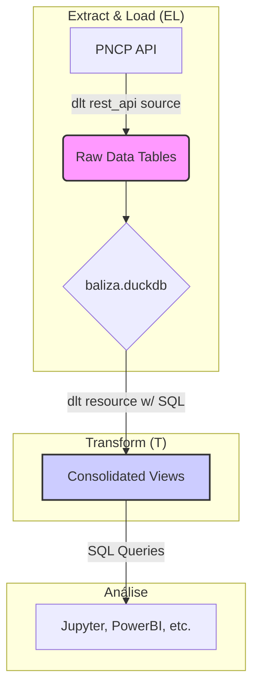

# 📝 Guia do Desenvolvedor (Claude) para o Projeto BALIZA

Este documento é seu guia para entender e trabalhar no projeto BALIZA. Ele detalha a arquitetura, as decisões de design e como você, como assistente de IA, pode contribuir de forma eficaz.

## 🎯 Visão Geral da Arquitetura

O BALIZA v2.0 adota uma arquitetura de ELT (Extract, Load, Transform) moderna, utilizando `dlt` para a extração e carregamento, e o próprio DuckDB para a transformação.



**Componentes Principais:**

1.  **`resources.py`**: Define a configuração declarativa para a fonte `dlt.sources.rest_api`. É o coração da extração, definindo endpoints e parâmetros.
2.  **`pipeline.py`**: Contém os pipelines `dlt` para:
    *   **Ingestão (`pncp_source`, `pncp_backfill_resource`):** Carrega dados brutos da API para tabelas de preparo (`_publicacao`).
    *   **Transformação (`create_consolidated_views`):** Executa SQL para criar views unificadas a partir dos dados brutos.
3.  **`models.py`**: Modelos Pydantic que definem o esquema esperado dos dados da API. Usados pelo `dlt` para validação em tempo de execução.
4.  **`cli.py`**: Interface de linha de comando (Typer) que orquestra a execução dos pipelines.

## 🌊 Fluxo de Dados (Layered Data Modeling)

A principal decisão de design é a separação dos dados em camadas, o que garante rastreabilidade e resiliência.

1.  **Camada Bruta (Raw Layer):**
    *   **Tabelas:** `contratos_publicacao`, `atas_publicacao`, etc.
    *   **Propósito:** Armazenar uma cópia exata e imutável dos dados como eles vêm da API. `_publicacao` contém o histórico completo (backfill).
    *   **Sua Tarefa:** Ao modificar a ingestão, garanta que os dados brutos sejam sempre anexados a essas tabelas sem transformação.

2.  **Camada de Conciliação (Staging/View Layer):**
    *   **Views:** `v_contratos_recentes`, `v_atas_recentes`, etc.
    *   **Propósito:** Unificar os dados das tabelas `_publicacao`, deduplicar e apresentar a versão mais recente de cada registro para o usuário final.
    *   **Sua Tarefa:** A lógica de conciliação (usando `ROW_NUMBER()` e `PARTITION BY`) está no recurso `create_consolidated_views` em `pipeline.py`. Se um novo endpoint for adicionado, você deve criar a lógica de view correspondente aqui.

## 🛠️ Como Trabalhar no Código

### Modificando a Extração de Dados

**Cenário:** Adicionar um novo endpoint da API do PNCP (ex: `/v1/planos`).

1.  **Modele a Resposta (`models.py`):** Crie um novo modelo Pydantic, `PlanoDTO`, que corresponda à estrutura JSON do novo endpoint.
2.  **Defina o Recurso (`resources.py`):**
    *   Adicione o novo endpoint à função `_create_backfill_resources`.
    *   Defina o `table_name` (ex: `planos_publicacao`).
3.  **Aplique o Schema (`pipeline.py`):** No `pncp_source`, adicione uma condição para aplicar o `PlanoDTO` ao novo recurso.
    ```python
    # em pipeline.py, dentro de pncp_source
    if "planos" in resource.name:
        resource.apply_hints(columns=PlanoDTO)
    ```
4.  **Crie a View de Conciliação (`pipeline.py`):**
    *   No recurso `create_consolidated_views`, adicione uma nova string SQL para criar a `v_planos_recentes`.
    *   Siga o padrão `UNION ALL` + `ROW_NUMBER()` para unificar `planos_publicacao`.

### Modificando a Lógica de Transformação

**Cenário:** Alterar como os contratos são deduplicados.

1.  **Localize a Lógica:** Abra `pipeline.py` e encontre o recurso `create_consolidated_views`.
2.  **Edite a SQL:** Modifique a string SQL para a `CREATE OR REPLACE VIEW v_contratos_recentes`.
3.  **Teste a Transformação:** Execute `baliza transform` no CLI. Isso irá recriar a view sem precisar baixar os dados novamente, tornando o ciclo de desenvolvimento muito mais rápido.

## ✅ Testes e Verificação

Embora os testes automatizados não estejam no escopo inicial, é crucial que você verifique suas alterações manualmente.

1.  **Limpe o Ambiente:** Antes de testar, remova o banco de dados antigo para garantir um estado limpo.
    ```bash
    rm baliza.duckdb baliza.duckdb.wal
    ```
2.  **Execute o Backfill (Pequeno Período):**
    ```bash
    python -m baliza.cli backfill --start-date 20240101 --end-date 20240102
    ```
3.  **Inspecione o Banco de Dados:**
    ```bash
    # Inicie o DuckDB CLI
    duckdb baliza.duckdb

    # Verifique as tabelas brutas
    .tables
    SELECT COUNT(*) FROM contratos_publicacao;

    # Verifique as views
    SELECT COUNT(*) FROM v_contratos_recentes;
    ```

## 🚨 Pontos de Atenção

*   **Nunca transforme os dados brutos:** A camada bruta é sagrada. Todas as transformações devem ocorrer na camada de views.
*   **Mantenha a consistência:** Ao adicionar novos recursos, siga o padrão existente (`_publicacao`, `v_..._recentes`).
*   **Use o CLI para testar:** O CLI (`backfill`, `transform`) é a maneira mais confiável de testar o fluxo completo.

Este guia deve fornecer tudo o que você precisa para trabalhar de forma autônoma e eficaz no projeto BALIZA. Lembre-se, o objetivo é criar um pipeline de dados robusto, transparente e fácil de manter.
