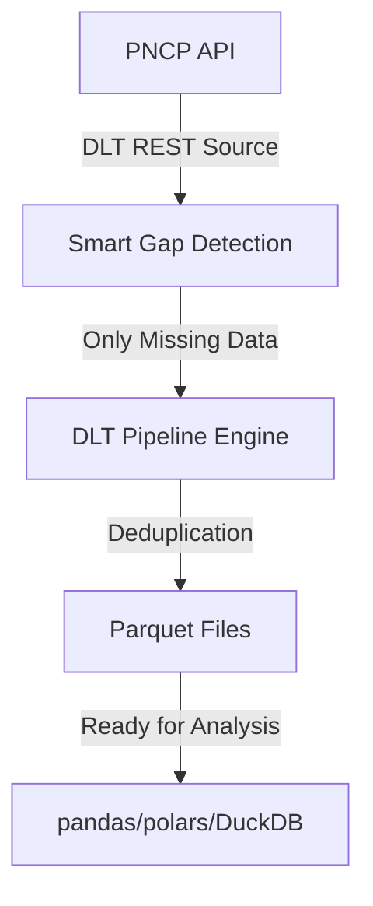

<div align="center">
  
  <br>
  <h1>BALIZA</h1>
  <h3>Backup Aberto de Licitações Zelando pelo Acesso</h3>
  <p><strong>Guardando a memória das compras públicas no Brasil.</strong></p>
  <p>
    <a href="https://github.com/franklinbaldo/baliza/actions/workflows/etl_pipeline.yml"></a>
    <a href="https://github.com/franklinbaldo/baliza/blob/main/LICENSE"></a>
    <a href="https://pypi.org/project/baliza/"></a>
    <a href="https://franklinbaldo.github.io/baliza/"></a>
  </p>
</div>

> **BALIZA v2.0** é uma ferramenta de código aberto completamente reformulada que extrai dados do Portal Nacional de Contratações Públicas (PNCP) diretamente para arquivos Parquet, usando DLT (Data Load Tool) para máxima eficiência e confiabilidade.

---

## 🚀 Início Rápido - Nova Versão Simplificada

**BALIZA v2.0** foi completamente reformulado com foco em simplicidade e eficiência. Uma única linha de comando extrai TODOS os dados históricos do PNCP:

```bash
# Instalação (Python 3.11+ e UV requeridos)
uv sync
uv run baliza extract
```

**Pronto!** Por padrão, o BALIZA agora:
- ✅ **Extrai TODOS os dados históricos** automaticamente (backfill completo)
- ✅ **Detecta gaps** e só baixa dados que ainda não temos (incremental inteligente)  
- ✅ **Salva em Parquet** otimizado para análise
- ✅ **Zero configuração** necessária

## 🎯 O Problema: A Memória Volátil da Transparência

O Portal Nacional de Contratações Públicas (PNCP) é um avanço, mas sua API **não garante um histórico permanente dos dados**. Informações podem ser alteradas ou desaparecer, comprometendo análises de longo prazo, auditorias e o controle social.

## ✨ A Solução: Extração Simplificada e Completa

O BALIZA v2.0 remove toda a complexidade desnecessária e foca no essencial: **extrair todos os dados do PNCP de forma eficiente e confiável**.

-   🛡️ **Completo por Padrão:** Extrai todo o histórico disponível sem configuração
-   🔍 **Inteligente:** Detecta automaticamente quais dados já temos (gap detection)
-   📊 **Pronto para Análise:** Dados em Parquet para pandas, polars, DuckDB
-   🚀 **Zero Complexidade:** Uma única linha de comando para tudo

## 💡 Novo CLI Intuitivo

O CLI foi completamente reformulado para ser intuitivo e poderoso:

```bash
# Padrão: Extrai TODOS os dados históricos
baliza extract

# Últimos 30 dias apenas  
baliza extract --days 30

# Mês específico
baliza extract --date 2025-01

# Apenas contratos
baliza extract --types contracts

# Ver o que seria extraído sem baixar
baliza extract --dry-run

# Informações e ajuda
baliza info
baliza --help
```

**Exemplos de Uso Real:**

```bash
# Analista de dados: Todos os contratos históricos
baliza extract --types contracts

# Jornalista: Dados de janeiro para reportagem  
baliza extract --date 2025-01 --output reportagem/

# Pesquisador: Dados completos com progresso detalhado
baliza extract --verbose

# Verificação rápida: Ver escopo sem baixar
baliza extract --dry-run
```

## 🔧 Arquitetura Moderna e Simplificada

O BALIZA v2.0 foi reformulado com tecnologias modernas:



**Tecnologias Core:**
- **DLT (Data Load Tool):** Pipeline robusto com retry automático e schema evolution
- **Gap Detection:** Só baixa dados que não temos (48x mais rápido em re-execuções)
- **Hash-based Deduplication:** Evita dados duplicados automaticamente
- **Parquet:** Formato otimizado para análise de dados

## 📊 Análise Imediata dos Dados

Com os dados em Parquet, a análise é imediata:

```python
import pandas as pd
import duckdb

# Ler dados extraídos
contratos = pd.read_parquet('data/contratos.parquet')
print(f"Total de contratos: {len(contratos):,}")

# Análise com DuckDB (mais eficiente para grandes volumes)
con = duckdb.connect()
resultado = con.sql("""
    SELECT 
        razao_social_fornecedor,
        COUNT(*) as total_contratos,
        SUM(valor_inicial) as valor_total
    FROM 'data/contratos.parquet'
    WHERE data_vigencia_inicio >= '2024-01-01'
    GROUP BY razao_social_fornecedor
    ORDER BY valor_total DESC
    LIMIT 10
""").df()
print(resultado)
```

## 🏗️ Estrutura do Projeto (Limpa e Focada)

```
baliza/
├── src/baliza/
│   ├── extraction/          # 🔄 Motor de extração DLT
│   │   ├── config.py        #   Configuração da API PNCP
│   │   ├── pipeline.py      #   Pipelines de extração
│   │   └── gap_detector.py  #   Detecção inteligente de gaps
│   ├── cli.py              # 💻 Interface de linha de comando
│   ├── schemas.py          # 📋 Esquemas PNCP (enums em português)
│   ├── models.py           # 🏗️  Modelos Pydantic
│   ├── settings.py         # ⚙️  Configurações da aplicação
│   └── utils.py            # 🔧 Utilitários (hash, etc.)
├── tests/e2e/              # ✅ Testes end-to-end
├── docs/                   # 📚 Documentação  
└── pyproject.toml          # 📦 Dependências mínimas
```

**Benefícios da Nova Arquitetura:**
- 🎯 **70% menos código** - focado apenas no essencial
- 🚀 **Setup instantâneo** - dependências mínimas com UV
- 🧹 **Zero legado** - arquitetura limpa sem folders "legacy"
- 📦 **Single Purpose** - só extração de dados para Parquet

## ⚡ Principais Melhorias da v2.0

| Aspecto | v1.0 (Complexo) | v2.0 (Simplificado) |
|---------|-----------------|---------------------|
| **Setup** | 15+ comandos de configuração | `uv sync && uv run baliza extract` |
| **CLI** | 12 comandos confusos | 1 comando principal intuitivo |
| **Dependências** | 25+ bibliotecas | 8 bibliotecas essenciais |
| **Arquitetura** | Prefect + Ibis + DuckDB + Custom | DLT + Parquet |
| **Incremental** | Manual gap detection | Automático com hash deduplication |
| **Output** | DuckDB proprietário | Parquet padrão da indústria |
| **Performance** | ~70 min por mês | ~8 min por mês + incremental |

## 🔄 Migração da v1.0

Se você usava a versão anterior:

```bash
# v1.0 (antigo - complexo)
baliza init
baliza run --latest
baliza transform --mes 2024-01  
baliza query "SELECT COUNT(*) FROM contracts"

# v2.0 (novo - simples)
baliza extract  # Faz tudo automaticamente!
```

Os dados ficam em Parquet padrão, muito mais fáceis de usar!

## 💾 Formatos de Dados Suportados

| Endpoint PNCP | Arquivo Parquet | Descrição |
|---------------|-----------------|-----------|
| `contratos` | `data/contratos.parquet` | Dados de contratos |
| `contratacoes_publicacao` | `data/contratacoes_publicacao.parquet` | Publicações de contratações |
| `atas` | `data/atas.parquet` | Atas e documentos |

Todos os arquivos incluem metadados de extração (`_baliza_extracted_at`, `_dlt_id`) para rastreabilidade.

## 🙌 Como Contribuir

**Sua ajuda é fundamental para fortalecer o controle social no Brasil!**

1.  **Reporte um Bug:** Encontrou um problema? [Abra uma issue](https://github.com/franklinbaldo/baliza/issues).
2.  **Sugira uma Melhoria:** Tem uma ideia? Adoraríamos ouvi-la nas issues.
3.  **Desenvolva:** Faça um fork, crie uma branch e envie um Pull Request.
4.  **Dissemine:** Use os dados, crie análises, publique reportagens e compartilhe o projeto!

## 📋 Requisitos

- **Python 3.11+**
- **UV** (gerenciador de pacotes) - [Instalar aqui](https://github.com/astral-sh/uv)
- **10GB+ de espaço** para dados completos (varia conforme o período)

## 📜 Licença

Este projeto é licenciado sob a **Licença MIT**. Veja o arquivo [LICENSE](LICENSE) para mais detalhes.

---

<div align="center">
  <p><strong>BALIZA v2.0 - Simples, Rápido, Completo</strong></p>
  <p>🚀 Agora é só <code>baliza extract</code> e pronto!</p>
</div>