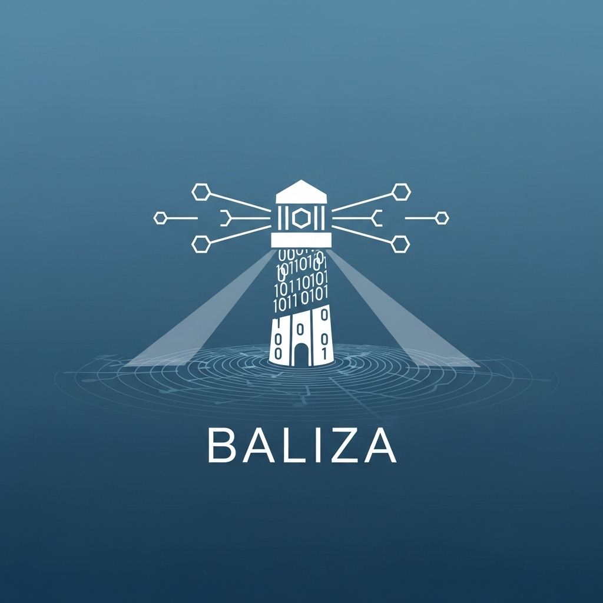
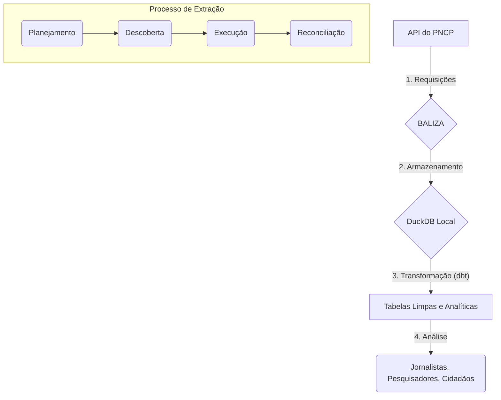

<div align="center">
  
  <br>
  <h3>Backup Aberto de Licitações Zelando pelo Acesso</h3>
  <p><strong>Guardando a memória das compras públicas no Brasil.</strong></p>
  <p>
    <a href="https://github.com/franklinbaldo/baliza/blob/main/LICENSE"></a>
    <a href="https://github.com/franklinbaldo/baliza/actions/workflows/baliza_daily_run.yml"></a>
    <a href="https://pypi.org/project/baliza/"></a>
  </p>
</div>

> **BALIZA** é uma ferramenta de código aberto que extrai, armazena e estrutura dados do Portal Nacional de Contratações Públicas (PNCP), criando um backup histórico confiável para análises e auditoria da maior plataforma de compras públicas do país.

---

## 🚀 Para Análise de Dados (Comece Aqui)

Seu objetivo é **analisar os dados** de contratações públicas, sem a necessidade de executar o processo de extração. Com o BALIZA, você pode fazer isso em segundos, diretamente no seu navegador ou ambiente de análise preferido.

<a href="https://colab.research.google.com/github/colab-examples/colab-badge-example/blob/main/colab-badge-example.ipynb" target="_parent"></a>

O banco de dados completo e atualizado diariamente está hospedado no [Internet Archive](https://archive.org/details/baliza-pncp) em formato DuckDB, e pode ser consultado remotamente.

**Exemplo de Análise Rápida com Python:**
Não é preciso baixar nada! Apenas instale as bibliotecas e execute o código.

```python
# Instale as bibliotecas necessárias
# !pip install duckdb pandas

import duckdb

# Conecte-se remotamente ao banco de dados no Internet Archive
# NOTA: Substitua 'baliza-latest.duckdb' pelo nome do arquivo mais recente disponível no IA
DB_URL = "https://archive.org/download/baliza-pncp/baliza-latest.duckdb"

con = duckdb.connect(database=DB_URL, read_only=True)

# Exemplo: Top 10 órgãos por valor total de contratos (camada GOLD)
top_orgaos = con.sql("""
    SELECT
        nome_orgao,
        SUM(valor_total_contrato) AS valor_total
    FROM mart_procurement_analytics
    GROUP BY nome_orgao
    ORDER BY valor_total DESC
    LIMIT 10;
""").to_df()

print(top_orgaos)
```

- ✅ **Zero Setup:** Comece a analisar em menos de um minuto.
- ✅ **Sempre Atualizado:** Acesse os dados mais recentes coletados pelo workflow diário.
- ✅ **Integração Total:** Funciona perfeitamente com Pandas, Polars, Jupyter Notebooks e outras ferramentas do ecossistema PyData.


## 🎯 O Problema: A Memória Volátil da Transparência

O Portal Nacional de Contratações Públicas (PNCP) é um avanço, mas sua API **não garante um histórico permanente dos dados**. Informações podem ser alteradas ou desaparecer, comprometendo análises de longo prazo, auditorias e o controle social.

## ✨ A Solução: Um Backup para o Controle Social

O BALIZA atua como uma **âncora de dados para o PNCP**. Ele sistematicamente coleta, armazena e estrutura os dados, garantindo que a memória das contratações públicas brasileiras seja preservada e acessível a todos.

-   🛡️ **Resiliência:** Cria um backup imune a mudanças na API ou indisponibilidades do portal.
-   🕰️ **Séries Históricas:** Constrói um acervo completo e cronológico.
-   🔍 **Dados Estruturados para Análise:** Transforma respostas JSON em tabelas limpas e prontas para SQL.
-   🌍 **Aberto por Natureza:** Utiliza formatos abertos (DuckDB, Parquet), garantindo que os dados sejam seus, para sempre.


## 🔧 Para Desenvolvedores e Coletores de Dados

Seu objetivo é **executar o processo de extração** para criar ou atualizar o banco de dados localmente.

**Pré-requisitos:**
- Python 3.11+
- [uv](https://github.com/astral-sh/uv) (um instalador de pacotes Python extremamente rápido)

**Instalação e Execução:**
```bash
# 1. Clone o repositório
git clone https://github.com/franklinbaldo/baliza.git
cd baliza

# 2. Instale as dependências com uv
uv sync

# 3. Execute a extração (isso pode levar horas!)
# Por padrão, extrai de 2021 até o mês atual
uv run baliza extract
```

**Principais Comandos:**
| Comando | Descrição |
|---|---|
| `uv run baliza extract` | Inicia a extração de dados do PNCP. |
| `uv run baliza extract --concurrency 4` | Limita o número de requisições paralelas. |
| `uv run dbt run --profiles-dir dbt_baliza` | Executa os modelos de transformação do dbt. |
| `uv run baliza stats` | Mostra estatísticas sobre os dados já baixados. |


## ⚙️ Como Funciona

O BALIZA opera com uma arquitetura de extração em fases, garantindo que o processo seja robusto e possa ser retomado em caso de falhas.


_**Legenda:** O BALIZA orquestra a coleta da API do PNCP, armazena os dados brutos em um banco DuckDB e, com dbt, os transforma em insumos para análise._


## 🤖 Servidor de Análise com IA (MCP)

O BALIZA inclui um servidor compatível com o **Model Context Protocol (MCP)** da Anthropic. Isso permite que modelos de linguagem, como o Claude, se conectem diretamente aos seus dados de licitações para realizar análises complexas, consultas e visualizações de forma segura.

**Como Funciona:**
Em vez de você fazer uma pergunta diretamente, você inicia um servidor local. Um LLM compatível com MCP pode então se conectar a este servidor para usar as "ferramentas" que ele oferece, como a capacidade de executar consultas SQL no seu banco de dados.

**Exemplo de Uso:**
```bash
# 1. Inicie o servidor MCP
# O servidor ficará em execução, aguardando conexões de um LLM
uv run baliza mcp

# 2. Conecte seu LLM ao servidor
# Use uma ferramenta como o MCP Workbench da Anthropic ou configure um
# cliente LLM para se conectar a http://127.0.0.1:8000.
```

O servidor expõe as seguintes capacidades ao LLM:
- **`baliza/available_datasets`**: Lista os conjuntos de dados disponíveis.
- **`baliza/dataset_schema`**: Descreve as colunas e tipos de dados de um dataset.
- **`baliza/execute_sql_query`**: Executa uma consulta SQL de leitura (`SELECT`) nos dados.

- 🧠 **Análise Profunda:** Permite que o LLM explore os dados de forma autônoma para responder a perguntas complexas.
- 🔒 **Segurança em Primeiro Lugar:** O servidor só permite consultas de leitura (`SELECT`), impedindo qualquer modificação nos dados.
- ⚙️ **Padrão Aberto:** Baseado no Model Context Protocol, garantindo interoperabilidade.

Para saber mais sobre a arquitetura, leia nosso [**Guia Teórico do MCP**](./docs/mcp_guide.md).


## 🏗️ Arquitetura e Tecnologias

| Camada | Tecnologias | Propósito |
|---|---|---|
| **Coleta** | Python, asyncio, httpx, tenacity | Extração eficiente, assíncrona e resiliente. |
| **Armazenamento** | DuckDB | Banco de dados analítico local, rápido e sem servidor. |
| **Transformação** | dbt (Data Build Tool) | Transforma dados brutos em modelos de dados limpos e confiáveis. |
| **Interface** | Typer, Rich | CLI amigável, informativa e com ótima usabilidade. |
| **Dependências**| uv (da Astral) | Gerenciamento de pacotes e ambientes virtuais de alta performance. |

## 🗺️ Roadmap do Projeto

-   [✅] **Fase 1: Fundação** - Extração resiliente, armazenamento em DuckDB, CLI funcional.
-   [⏳] **Fase 2: Expansão e Acessibilidade** - Modelos dbt analíticos, exportação para Parquet, documentação aprimorada.
-   [🗺️] **Fase 3: Ecossistema e Análise** - Dashboards de cobertura, sistema de plugins, tutoriais.
-   [💡] **Futuro:** Painel de monitoramento de dados, detecção de anomalias, integração com mais fontes.

## 🙌 Como Contribuir

**Sua ajuda é fundamental para fortalecer o controle social no Brasil!**

1.  **Reporte um Bug:** Encontrou um problema? [Abra uma issue](https://github.com/franklinbaldo/baliza/issues).
2.  **Sugira uma Melhoria:** Tem uma ideia? Adoraríamos ouvi-la nas issues.
3.  **Desenvolva:** Faça um fork, crie uma branch e envie um Pull Request.
4.  **Dissemine:** Use os dados, crie análises, publique reportagens e compartilhe o projeto!

## 📜 Licença

Este projeto é licenciado sob a **Licença MIT**. Veja o arquivo [LICENSE](LICENSE) para mais detalhes.
