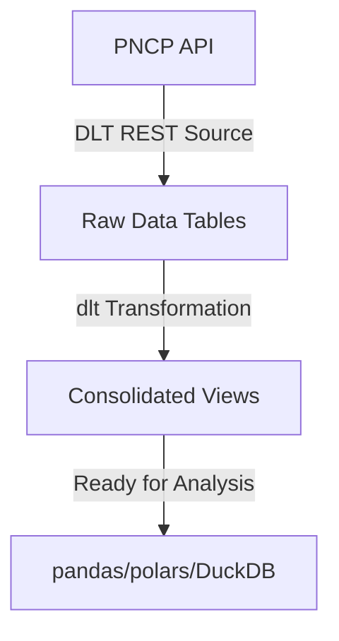

<div align="center">
  
  <br>
  <h1>BALIZA</h1>
  <h3>Backup Aberto de Licitações Zelando pelo Acesso</h3>
  <p><strong>Guardando a memória das compras públicas no Brasil.</strong></p>
  <p>
    <a href="https://github.com/franklinbaldo/baliza/actions/workflows/etl_pipeline.yml"></a>
    <a href="https://github.com/franklinbaldo/baliza/blob/main/LICENSE"></a>
    <a href="https://pypi.org/project/baliza/"></a>
    <a href="https://franklinbaldo.github.io/baliza/"></a>
  </p>
</div>

> **BALIZA v2.0** é uma ferramenta de código aberto completamente reformulada que extrai dados do Portal Nacional de Contratações Públicas (PNCP) diretamente para um banco de dados DuckDB, usando DLT (Data Load Tool) para máxima eficiência e confiabilidade.

---

## 🚀 Início Rápido

**BALIZA v2.0** foi completamente reformulado com foco em simplicidade e eficiência.

### Backfill Histórico
```bash
# Instalação (Python 3.11+ e UV requeridos)
uv sync
uv run baliza backfill --start-date 20210101 --end-date 20240101
```

**Pronto!** Por padrão, o BALIZA agora:
- ✅ **Extrai dados históricos** de forma robusta.
- ✅ **Deduplicação de dados** para evitar armazenamento de duplicatas.
- ✅ **Salva em DuckDB** otimizado para análise.
- ✅ **Zero configuração** necessária.

## 🎯 O Problema: A Memória Volátil da Transparência

O Portal Nacional de Contratações Públicas (PNCP) é um avanço, mas sua API **não garante um histórico permanente dos dados**. Informações podem ser alteradas ou desaparecer, comprometendo análises de longo prazo, auditorias e o controle social.

## ✨ A Solução: Arquitetura de Dados em Camadas

O BALIZA v2.0 implementa uma arquitetura de dados em camadas para garantir a qualidade e a consistência dos dados.

-   🛡️ **Camada Bruta (Raw):** Tabelas para dados de publicação (`_publicacao`).
-   🔍 **Camada de Conciliação (Staging):** Views que unificam os dados, mostrando a versão mais recente de cada registro.
-   📊 **Pronto para Análise:** Views finais prontas para análise em ferramentas como pandas, polars, DuckDB, etc.

## 💡 CLI Intuitivo

O CLI foi completamente reformulado para ser intuitivo e poderoso:

```bash
# Backfill histórico de um período específico
baliza backfill --start-date 20210101 --end-date 20240101

# Executa apenas a etapa de transformação (criação de visualizações)
baliza transform

# Informações e ajuda
baliza info
baliza --help
```

## 🔧 Arquitetura Moderna e Simplificada

O BALIZA v2.0 foi reformulado com tecnologias modernas e **pipeline profissional implementado**:


```mermaid
flowchart TD
    A[PNCP API] -->|DLT REST Source| B[Raw Data Tables]
    B -->|dlt Transformation| C[Consolidated Views]
    C -->|Ready for Analysis| E[pandas/polars/DuckDB]
```

**Tecnologias Core:**
- **DLT (Data Load Tool):** Pipeline robusto com retry automático e schema evolution.
- **DuckDB:** Banco de dados analítico rápido e eficiente.
- **Pydantic:** Validação de dados na ingestão.

## 📊 Análise Imediata dos Dados

Com os dados em DuckDB, a análise é imediata:

```python
import duckdb

# Conectar ao banco de dados
con = duckdb.connect('baliza.duckdb')

# Análise com DuckDB
resultado = con.sql("""
    SELECT 
        razaoSocialFornecedor,
        COUNT(*) as total_contratos,
        SUM(valorGlobal) as valor_total
    FROM v_contratos_recentes
    WHERE dataAssinatura >= '2024-01-01'
    GROUP BY razaoSocialFornecedor
    ORDER BY valor_total DESC
    LIMIT 10
""").df()
print(resultado)
```

## 🏗️ Estrutura do Projeto (Limpa e Focada)

```
baliza/
├── src/baliza/
│   ├── pipeline.py            # 🚀 Pipeline de ingestão e transformação
│   ├── resources.py           # 🎯 Definições de recursos da API
│   ├── models.py              # 📋 Modelos Pydantic
│   ├── cli.py                 # 💻 Interface de linha de comando
│   └── utils/                 # 🔧 Utilitários
├── tests/
│   └── test_pipeline.py       # ✅ Testes automatizados
└── .github/workflows/
    └── ci.yml                 # 🔄 CI/CD profissional
```

## 🙌 Como Contribuir

**Sua ajuda é fundamental para fortalecer o controle social no Brasil!**

1.  **Reporte um Bug:** Encontrou um problema? [Abra uma issue](https://github.com/franklinbaldo/baliza/issues).
2.  **Sugira uma Melhoria:** Tem uma ideia? Adoraríamos ouvi-la nas issues.
3.  **Desenvolva:** Faça um fork, crie uma branch e envie um Pull Request.
4.  **Dissemine:** Use os dados, crie análises, publique reportagens e compartilhe o projeto!

## 📜 Licença

Este projeto é licenciado sob a **Licença MIT**. Veja o arquivo [LICENSE](LICENSE) para mais detalhes.

---

<div align="center">
  <p><strong>BALIZA v2.0 - Simples, Rápido, Completo</strong></p>
</div>
