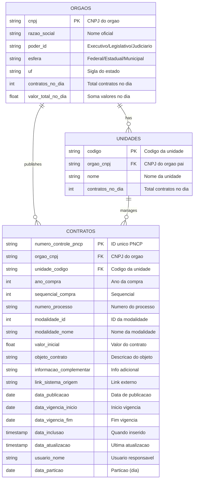
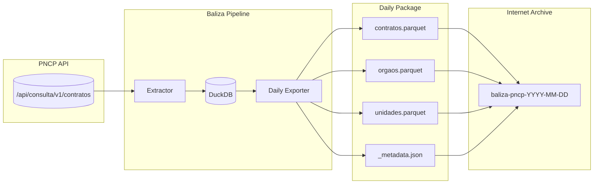
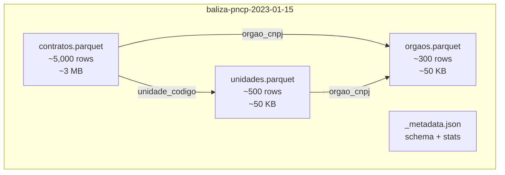

# Baliza Parquet Schema Design

> Daily self-contained relational data lake for Brazilian public procurement (PNCP).

## Design Principles

1. **Daily partitioning** - One package per day
2. **Relational structure** - Normalized tables with foreign keys
3. **Self-contained** - Each day can be queried independently
4. **Snake_case** - Python naming convention
5. **Raw data** - No pre-computed aggregations

---

## Directory Structure

### Internet Archive Item

Each day is uploaded as a single Internet Archive item:

```
baliza-pncp-2023-01-15/           # IA item ID
├── contratos.parquet             # Main contract data
├── orgaos.parquet                # Organizations (deduplicated for this day)
├── unidades.parquet              # Organizational units
├── itens.parquet                 # Contract line items (future)
└── _metadata.json                # Schema version, extraction info
```

### Local Export Structure

```
data/
└── daily/
    └── 2023-01-15/
        ├── contratos.parquet
        ├── orgaos.parquet
        ├── unidades.parquet
        └── _metadata.json
```

---

## Table Schemas

### 1. `contratos.parquet` (Main Fact Table)

Primary contract data with foreign keys to dimension tables.

```python
import pyarrow as pa

CONTRATOS_SCHEMA = pa.schema([
    # Primary Key
    pa.field("numero_controle_pncp", pa.string(), nullable=False),

    # Foreign Keys
    pa.field("orgao_cnpj", pa.string(), nullable=False),      # -> orgaos.cnpj
    pa.field("unidade_codigo", pa.string(), nullable=True),   # -> unidades.codigo

    # Contract Identification
    pa.field("ano_compra", pa.int32(), nullable=True),
    pa.field("sequencial_compra", pa.int32(), nullable=True),
    pa.field("numero_processo", pa.string(), nullable=True),

    # Modality
    pa.field("modalidade_id", pa.int32(), nullable=True),
    pa.field("modalidade_nome", pa.string(), nullable=True),

    # Financial
    pa.field("valor_inicial", pa.float64(), nullable=True),  # DECIMAL as float64

    # Contract Details
    pa.field("objeto_contrato", pa.string(), nullable=True),
    pa.field("informacao_complementar", pa.string(), nullable=True),
    pa.field("link_sistema_origem", pa.string(), nullable=True),

    # Dates
    pa.field("data_publicacao", pa.date32(), nullable=True),
    pa.field("data_vigencia_inicio", pa.date32(), nullable=True),
    pa.field("data_vigencia_fim", pa.date32(), nullable=True),
    pa.field("data_inclusao", pa.timestamp("us"), nullable=True),
    pa.field("data_atualizacao", pa.timestamp("us"), nullable=True),

    # Audit
    pa.field("usuario_nome", pa.string(), nullable=True),

    # Partition (redundant but useful for queries)
    pa.field("data_particao", pa.date32(), nullable=False),
])
```

**Row count**: ~1,000-10,000 per day (varies)

---

### 2. `orgaos.parquet` (Organization Dimension)

Deduplicated organizations appearing in this day's contracts.

```python
ORGAOS_SCHEMA = pa.schema([
    # Primary Key
    pa.field("cnpj", pa.string(), nullable=False),

    # Organization Data
    pa.field("razao_social", pa.string(), nullable=True),
    pa.field("poder_id", pa.string(), nullable=True),

    # Derived fields (can be computed from CNPJ or enriched later)
    pa.field("esfera", pa.string(), nullable=True),      # Federal, Estadual, Municipal
    pa.field("uf", pa.string(), nullable=True),          # State code

    # Stats for this day (denormalized for convenience)
    pa.field("contratos_no_dia", pa.int32(), nullable=True),
    pa.field("valor_total_no_dia", pa.float64(), nullable=True),
])
```

**Row count**: ~100-500 per day (unique orgs)

---

### 3. `unidades.parquet` (Unit Dimension)

Organizational units (subdivisions of orgaos).

```python
UNIDADES_SCHEMA = pa.schema([
    # Primary Key
    pa.field("codigo", pa.string(), nullable=False),

    # Foreign Key
    pa.field("orgao_cnpj", pa.string(), nullable=False),  # -> orgaos.cnpj

    # Unit Data
    pa.field("nome", pa.string(), nullable=True),

    # Stats for this day
    pa.field("contratos_no_dia", pa.int32(), nullable=True),
])
```

**Row count**: ~200-1,000 per day (unique units)

---

### 4. `_metadata.json` (Package Metadata)

```json
{
    "schema_version": "1.0.0",
    "data_particao": "2023-01-15",
    "extracted_at": "2023-01-16T05:00:00Z",
    "source": "PNCP API v1",
    "tables": {
        "contratos": {
            "row_count": 5234,
            "file_size_bytes": 2456789
        },
        "orgaos": {
            "row_count": 312,
            "file_size_bytes": 45678
        },
        "unidades": {
            "row_count": 567,
            "file_size_bytes": 34567
        }
    },
    "baliza_version": "0.1.0"
}
```

---

## Entity Relationship Diagram



## Data Flow Diagram



## Package Structure



---

## Query Examples

### 1. Load a single day

```python
import duckdb

con = duckdb.connect()

# Load from Internet Archive or local
day = "2023-01-15"
base_url = f"https://archive.org/download/baliza-pncp-{day}"

contratos = con.read_parquet(f"{base_url}/contratos.parquet")
orgaos = con.read_parquet(f"{base_url}/orgaos.parquet")
```

### 2. Join contracts with organizations

```sql
SELECT
    c.numero_controle_pncp,
    c.objeto_contrato,
    c.valor_inicial,
    o.razao_social,
    o.uf
FROM contratos c
JOIN orgaos o ON c.orgao_cnpj = o.cnpj
WHERE c.valor_inicial > 1000000
ORDER BY c.valor_inicial DESC
```

### 3. Query multiple days (glob pattern)

```sql
-- Query all of January 2023
SELECT
    data_particao,
    COUNT(*) as total_contratos,
    SUM(valor_inicial) as valor_total
FROM read_parquet('data/daily/2023-01-*/contratos.parquet')
GROUP BY data_particao
ORDER BY data_particao
```

### 4. Query from Internet Archive (remote)

```sql
-- DuckDB can query remote Parquet directly
SELECT COUNT(*), SUM(valor_inicial)
FROM read_parquet([
    'https://archive.org/download/baliza-pncp-2023-01-15/contratos.parquet',
    'https://archive.org/download/baliza-pncp-2023-01-16/contratos.parquet'
])
```

---

## Internet Archive Naming Convention

| Item ID | Description |
|---------|-------------|
| `baliza-pncp-2023-01-15` | All tables for Jan 15, 2023 |
| `baliza-pncp-2023-01-16` | All tables for Jan 16, 2023 |
| `baliza-pncp-latest` | Pointer to most recent day (updated daily) |

### Metadata for IA Upload

```bash
ia upload baliza-pncp-2023-01-15 \
    data/daily/2023-01-15/*.parquet \
    data/daily/2023-01-15/_metadata.json \
    --metadata="collection:opensource" \
    --metadata="mediatype:data" \
    --metadata="title:Baliza PNCP - 2023-01-15" \
    --metadata="description:Brazilian public procurement contracts from PNCP for 2023-01-15. Contains normalized tables: contratos, orgaos, unidades." \
    --metadata="subject:brazil;procurement;pncp;open-data;government;contracts" \
    --metadata="creator:Baliza Project" \
    --metadata="date:2023-01-15"
```

---

## File Size Estimates

| Table | Rows/Day | Size/Day | Size/Year |
|-------|----------|----------|-----------|
| contratos | ~5,000 | ~2-5 MB | ~1-2 GB |
| orgaos | ~300 | ~50 KB | ~18 MB |
| unidades | ~500 | ~50 KB | ~18 MB |
| **Total** | | **~3-6 MB** | **~1-2 GB** |

---

## Compression Settings

```python
import pyarrow.parquet as pq

pq.write_table(
    table,
    path,
    compression="zstd",           # Better than snappy for archival
    compression_level=3,          # Balance speed/size
    write_statistics=True,        # Enable predicate pushdown
    row_group_size=10_000,        # Good for medium files
    version="2.6",                # Latest Parquet version
)
```

---

## Migration Path

### Phase 1: Implement daily export (current)
- Add `baliza export-daily` command
- Export to `data/daily/YYYY-MM-DD/` structure

### Phase 2: Backfill history
- Historical backfill workflow extracts + exports daily
- Upload complete days to Internet Archive

### Phase 3: Deprecate monthly exports
- Keep for backwards compatibility
- New consumers use daily structure

---

## Schema Versioning

Schema changes are tracked via `_metadata.json`:

```json
{
    "schema_version": "1.0.0"
}
```

**Version rules:**
- `1.0.x` - Bug fixes, no schema changes
- `1.x.0` - New optional columns (backwards compatible)
- `x.0.0` - Breaking changes (new table structure)

Consumers should check `schema_version` and handle accordingly.
