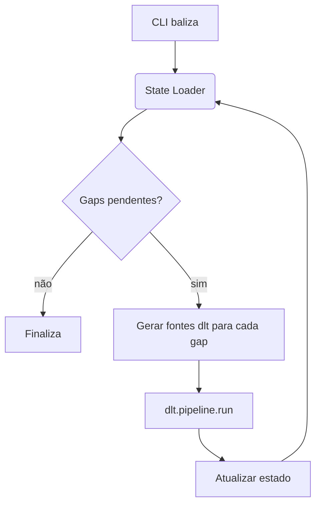

# Plano de resumibilidade e eficiência da extração

## Contexto

O pipeline atual do Baliza utiliza dlt com janelas explícitas de
`dataInicial`/`dataFinal` (formato `AAAAMMDD`) e um *lookback* configurável. A
cada execução, as janelas são percorridas página a página com
`tamanhoPagina=500`, registrando `totalPaginas` e hash dos
`numeroControlePNCP` em um manifesto (`baliza_state.cobertura`). Essa abordagem
garante idempotência no nível de dados (linhas duplicadas são descartadas pelo
`write_disposition = merge`) e oferece visibilidade sobre o que foi coletado,
porém ainda não evita chamadas HTTP redundantes nem permite retomar uma execução
exatamente do ponto de falha.

Este documento detalha como evoluir para uma extração verdadeiramente
resumível, minimizando requisições repetidas.

## Objetivos

1. **Persistir estado de execução** — registrar, para cada recurso, quais faixas
   de datas já foram extraídas com sucesso.
2. **Detectar lacunas automaticamente** — antes de cada execução, identificar os
   períodos ainda não cobertos e construir a lista de janelas a serem processadas.
3. **Reduzir chamadas redundantes** — evitar reprocessar janelas completas quando
   nenhuma atualização ocorreu desde a última execução.

## Arquitetura proposta



### Componentes

- **State Store (`pipeline_state.json`)**
  - Localizado no diretório do pipeline dlt.
  - Estrutura proposta:

```json
{
  "version": 1,
  "updated_at": "2025-07-28T12:00:00Z",
  "resources": {
    "contratos": {
      "completed": [["2024-01-01", "2024-01-31"]],
      "cursor": "2025-07-27T18:45:00Z"
    }
  }
}
```

- **StateManager**
  - Responsável por carregar, validar e persistir o JSON.
  - Expõe métodos para obter faixas concluídas e registrar novas janelas.

- **GapDetector**
  - Recebe o intervalo solicitado (ou `None` para incremental) e os dados do
    estado.
  - Retorna uma lista ordenada de lacunas a serem extraídas.

## Fluxo proposto

1. **Carregar estado** na inicialização do comando (`extract` ou `backfill`).
2. **Calcular lacunas** considerando o intervalo solicitado e o *lookback*.
3. **Executar pipeline** uma vez por lacuna para evitar janelas muito grandes.
4. **Persistir estado** após cada execução bem-sucedida:
   - Atualizar `completed` com a janela processada (mesclando intervalos
     sobrepostos).
   - Armazenar o manifesto de páginas capturado (`totalPaginas`, hashes) para
     detectar lacunas e crescimentos tardios no `baliza verify`.
5. **Relatar progresso** ao usuário com logs e resumo final.

## Plano de implementação

| Etapa | Descrição | Resultado esperado |
|-------|-----------|--------------------|
| 1 | Implementar `StateManager` com leitura/escrita atômica | Arquivo de estado confiável |
| 2 | Criar `GapDetector` que calcula diferença entre intervalos solicitados e concluídos | Lista de lacunas correta |
| 3 | Integrar na CLI (`baliza extract`) executando o pipeline uma vez por lacuna | Extração resiliente |
| 4 | Adicionar testes unitários para `StateManager` e `GapDetector` | Garantia contra regressões |
| 5 | Documentar variáveis de configuração (ex.: caminho do estado) | Onboarding facilitado |

## Considerações adicionais

- Enquanto a resumibilidade completa não estiver implementada, mantenha o
  *lookback* padrão em 3 dias para cobrir eventuais atrasos.
- Quando múltiplos endpoints forem ativados, o estado deve ser particionado por
  recurso (e por modalidade, se necessário).
- Avaliar o uso de armazenamento externo (S3/Blob) se o pipeline passar a rodar
  em múltiplas máquinas.
